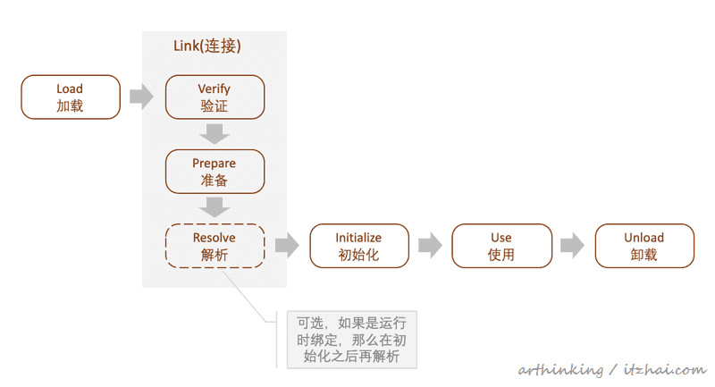
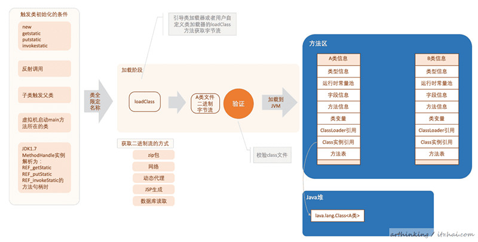
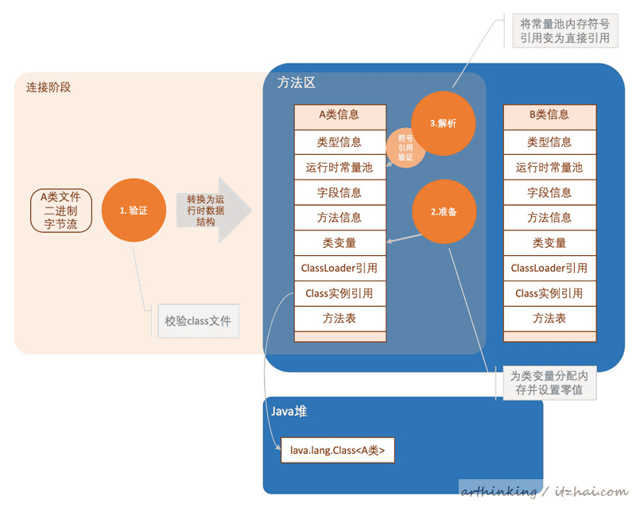
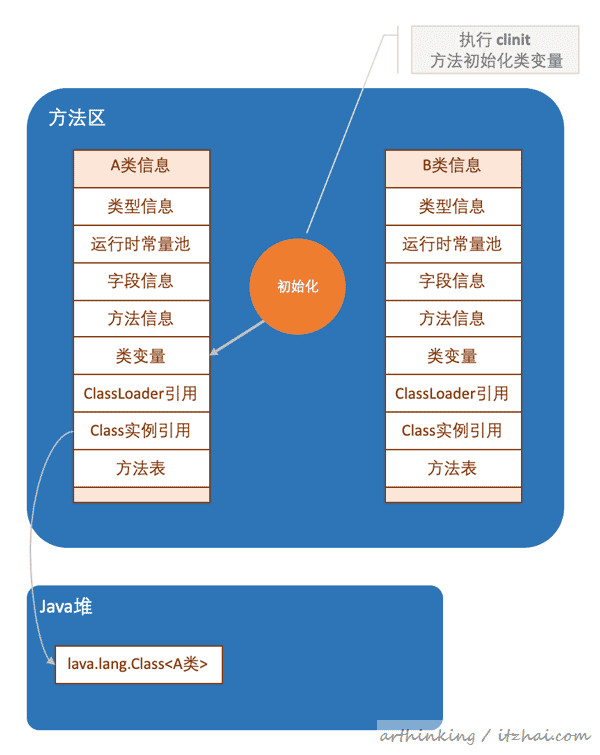
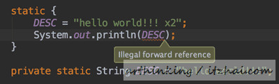

### Class文件是如何被加载进JVM的? 一篇图文带你彻底弄懂

#### 导读

一个Class文件，在加载进JVM的过程中，究竟经历了些什么?加载进JVM之后又会以什么样的形式呈现?看文本文，你可以了解到：  

1. Class.forName究竟是怎么获取Class对象的，Class对象又是什么?
2. Class文件是如何被加载到JVM里面的?
3. 类变量是存在堆中还是存在方法区中?
4. 类构造器<clinit>方法什么时候执行?

#### 关于类加载器

##### 1、加载一个Class文件

以下是类的生命周期：  



其中，如果是动态绑定或者晚期绑定，解析阶段不会再准备阶段后立刻执行。接下来我们就来看看是如何按照这个流程加载一个Class文件的。

思考：  
1.有如下代码：  

```java
public class TestLoadSubClass {
    public static void main(String[] args) {
        System.out.println(B.value);
    }
}

class A {
    static {
        System.out.println("init A ...");
    }
    static int value = 100;
  	static final String DESC = "test";
}

class B extends A {
    static {
        System.out.println("init B ...");
    }
}
```

猜猜会不会输出 init B  

2.猜猜以下语句会不会输出 init A  

```java 
A[] arrays = new A[10];
```

3.猜猜以下代码会不会输出 init A  

```java
System.out.println(A.DESC);
```

##### 1.1、加载阶段



> JVM规范并没有规定java.lang.Class类的实例要放到Java堆中，对于HotSpot虚拟机，是放到方法区里面的。
> 这个class对象作为程序访问方法区中的这些类型数据的外部接口。

如上图，加载阶段主要做以下事情：  

- 通过类全限定名获取定义此类的二进制字节流；
- 将字节流代表的静态存储结构转换为方法区的运行时数据结构；
- 在内存中生成此类的java.lang.Class对象，作为方法区这个类的各种数据的访问入口。

##### 1.1.1、如何触发加载Class文件

如上图，当以下任何一种情况发生的时候，会触发加载Class文件：  

- 遇到new、getstatic、putstatic或者invokestatic字节码指令的时候，如果类还没有初始化。对应场景为：

    - new一个对象；
    - 读取或者设置一个类的静态字段；
    - 调用类的静态方法的时候；


- 使用java.lang.reflect包的方法对类进行反射的时候，如果类还没有初始化；
- 初始化类的时候，如果父类还没有初始化，则触发父类初始化；
- 虚拟机器启动时，main方法所在的类会首先进行初始化；
- JDK1.7中使用动态语言支持的时候，如果一个java.lang.invoke.MethodHandler实例最后解析为：REF_getStatic，REF_putStatic，REF_invokeStatic方法句柄的时候，并且句柄所对应的类没有进行过初始化。  

这个时候通过类的全限定名称获取类的二进制字节流。  

此时这个字节流为静态存储结构，需要转换为方法区的运行时数据结构。结构如上图方法区中所示。每个类生成一个对应的结构，结构里面的信息详细介绍参考此文：[The Java Virtual Machine](https://www.artima.com/insidejvm/ed2/jvm5.html)

其中：  

**ClassLoader的引用：** 指的是加载这个Class文件的ClassLoader实例的引用；  
**Class实例引用：** 指的是类加载器在加载类信息并放到方法区之后，然后创建对应的Class类型的实例，并把该实例的引用保存到Class实例引用中。  

##### 1.1.2、获取二进制流的方式

如上图描述的，JVM规范[5.3. Creation and Loading](https://docs.oracle.com/javase/specs/jvms/se8/html/jvms-5.html#jvms-5.3)并没有指定class文件二进制流需要从哪里以什么方式获取，目前主要有以下几种获取方式：  

- zip包，延伸为JAR、EAR、WAR包；
- 网络，如Applet；
- 动态代理；
- JSP生成；
- 数据库获取；

##### 1.1.3、验证二进制字节流

如上图所示，在加载阶段就已经开始做部分验证工作了，但是验证还是属于连接阶段的动作，下面介绍验证阶段。  

##### 1.2、连接阶段



如上图：连接阶段包括：验证，准备，解析

##### 1.2.1、验证阶段

**验证阶段干什么事情**  

我们知道，class文件是可以被认为篡改的，虚拟机如果直接拿来执行，可能会把系统给搞崩溃了，所以一定要先对Class文件做严格的验证。验证阶段主要完成以下检测动作：  

##### 1.2.1.1、文件格式验证

主要按照[Class文件16进制背后的秘密](https://www.itzhai.com/jvm/the-secret-of-hexadecimal-class-file.html)文章中的阐述的格式，严格的进行校验。  

##### 1.2.1.2、元数据验证

主要是语义校验，保证不存在不符合Java语言规范的元数据信息，如：没有父类，继承了final类，接口的非抽象类实现没有完整实现方法等。

##### 1.2.1.3、字节码验证

主要对数据流和控制流进行分析，确定成行语义是否合法，符合逻辑。不合法的例子：  

- 操作数栈放置了int类型数据，却当成long类型使用；
- 把父类对象赋值给了子类数据类型；
- ...

##### 1.2.1.4、符号引用验证

解析阶段发生的验证，当把符号引用转化为直接引用的时候进行验证。这主要是对类自身以外的信息进行匹配性校验。主要包括：  

- 全限定名是否可以找到对应的类；
- 指定类是否存在符合方法的字段描述符以及简单名称所描述的方法和字段；
- 校验类，字段和方法的可见性；

##### 1.2.2、准备阶段

这个阶段还并没有开始执行类的构造方法，而只是为类变量分配内存并设置类变量初始值（零值）。这些变量所使用的内存都将在方法区中分配。  

基本数据类型的零值：[2.3. Primitive Types and Values](https://docs.oracle.com/javase/specs/jvms/se8/html/jvms-2.html#jvms-2.3)  

这里只分配static变量，不包括实例变量。  

> 注意：static final类型的常量value会在准备阶段被初始化为常量指定的值。
> 
> 静态变量存储在内存的PremGen（方法区域）空间中，其值存储在Heap中

##### 1.2.3、解析阶段

解析阶段主要将常量池内的符号引用替换为直接引用。  

**符号引用：** 字面量，引用目标不一定已经加载到内存中；  

**直接引用：** 直接指向目标的指针，或者相对偏移量，或是一个能简介定位到目标的句柄。直接引用和虚拟机实现的内存布局相关。  

> **关于动态语言的支持：** 通过invokedynamic指令支持动态语言。
> 该指令会对符号引用进行解析，但是不会缓存解析的结果，每次执行指令都需要重新解析。

解析主要针对以下七类符号引用进行：  

- 类或接口 CONSTANT_Class_info
- 字段 CONSTANT_Fieldref_info
- 类方法 CONSTANT_Methodref_info
- 接口方法 CONSTANT_InterfaceMethodref_info
- 方法类型 CONSTANT_MethodType_info
- 方法句柄 CONSTANT_MethodHandle_info
- 调用限定符 CONSTANT_InvokeDynamic_info

> 符号引用解析的过程或校验的过程中，可能又会触发另一个类的加载。

##### 1.3、初始化阶段



这阶段开始执行Java程序代码，这一步主要是执行类构造器`<clinit>`方法对类变量进行初始化的过程。**注意，这个方法不是构造方法。**  

下面就来介绍一下这个方法：  

##### 1.3.1、`<clinit>`方法

此方法是由编译器自动收集类中的所有类变量的赋值动作和静态语句块中的语句合并产生的方法，主要是给类变量做初始化工作的方法。

生成`<clinit>`方法的实例  

有如下代码：  

```java
public class TestInit {

    static {
        DESC = "hello world!!!";
    }

    private static String DESC;

    public void test() {
        DESC = "a";
    }

    public static void main(String[] args) {
        System.out.println(DESC);
    }

}
```

这个类中有一个静态变量DESC，并且在静态代码块中进行了赋值操作，我们看看其生成的汇编代码：  

```java
Constant pool:
   #1 = Methodref          #8.#26         // java/lang/Object."<init>":()V
   #2 = String             #27            // a
   #3 = Fieldref           #7.#28         // com/itzhai/classes/TestInit.DESC:Ljava/lang/String;
   ...
   #7 = Class              #34            // com/itzhai/classes/TestInit
   ...
   #9 = Utf8               DESC
   #10 = Utf8               Ljava/lang/String;
   ...
   #23 = Utf8               <clinit>
   #28 = NameAndType        #9:#10         // DESC:Ljava/lang/String;
   ...

  static {};
    descriptor: ()V
    flags: ACC_STATIC
    Code:
      stack=1, locals=0, args_size=0
         0: ldc           #6                  // String hello world!!!
         2: putstatic     #3                  // Field DESC:Ljava/lang/String;
         5: return
      LineNumberTable:
        line 9: 0
        line 10: 5
```

可以发现，生成了这样的一个方法。此方法既是生成的`<clinit>`方法。这里指令比较简单，主要是：拿到"hello world!!!"字符串的引用，把他设置到DESC类变量中。  

关于`<clinit>`方法的注意事项  

- **顺序问题：** 静态语句块后面的静态变量，静态语句块中可以赋值，但不可以访问；

- **继承执行顺序：** 无需显示调用，虚拟机会保证子类的`<clinit>`方法执行前，父类的`<clinit>`方法已经执行完毕；
- **接口的<clinit>方法：** 虽然接口不能有静态语句块，但是可以给静态变量初始化值，所以也可以生成`<clinit>`方法；
- **接口继承：** 除非使用到父接口的变量，否则执行子接口的`<clinit>`方法不需要先执行父接口的`<clinit>`方法；
- 在并发场景，虚拟机会保证一个类的`<clinit>`方法只有一个线程执行，其他线程会阻塞，所以要确保静态代码块中不需要考虑线程安全问题。

##### 本文整理自[一篇图文彻底弄懂Class文件是如何被加载进JVM的](https://www.itzhai.com/jvm/how-class-file-load-into-jvm.html)

### 总结

#### 类的生命周期

加载【Load】 -> 连接【Link】(验证【Verify】-> 准备【Prepare】-> 解析【Resolve】) -> 初始化【Initialize】-> 使用【Use】-> 卸载【Unload】 

#### 触发类加载的时机有哪些?

简言概括有以下几点：  

1. 创建类的实例，也就是new一个对象时；
2. 访问类的静态变量时；
3. 访问类的静态方法时；
4. 调用Class.forName(..)方法时；
5. 初始化一个类的子类(首先会初始化其父类)；
6. JVM虚拟机启动时(即定义了main方法的那个类)；

#### 类加载的方式有哪几种?

1. zip包，延伸为JAR、EAR、WAR包；
2. 网络，如Applet；
3. 动态代理；
4. JSP生成；
5. 数据库获取；

#### 类加载前的验证有哪些?

1. **文件格式验证：** 主要按照Class文件16进制背后的秘密文章中的阐述的格式，严格的进行校验。
2. **元数据验证：** 主要是语义校验，保证不存在不符合Java语言规范的元数据信息，如：没有父类，继承了final类，接口的非抽象类实现没有完整实现方法等。
3. **字节码验证：** 主要对数据流和控制流进行分析，确定成行语义是否合法，符合逻辑。不合法的例子如：操作数栈放置了int类型数据，却当成long类型使用；把父类对象赋值给了子类数据类型等；

4. **符号引用验证：** 解析阶段发生的验证，当把符号引用转化为直接引用的时候进行验证。这主要是对类自身以外的信息进行匹配性校验。主要包括：全限定名是否可以找到对应的类；指定类是否存在符合方法的字段描述符以及简单名称所描述的方法和字段；校验类，字段和方法的可见性；

#### `<clinit>`方法

此方法是由编译器自动收集类中的所有类变量的赋值动作和静态语句块中的语句合并产生的方法，主要是给类变量做初始化工作的方法。**注意，这个方法不是构造方法。**  
